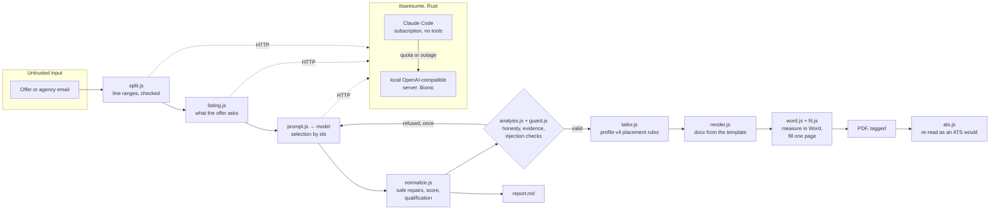

# Architecture

itsaresume-cv turns a job offer into a CV tailored to it (Word and PDF, in its
owner's two-column design, one full page, readable by an ATS) and a fit report
saying how well the profile meets the offer and what backs each claim. The
language model behind it is reached through
[itsaresume](https://github.com/SigSegGit/itsaresume), a Rust router that is
never billed per token.

The design follows from one sentence: **the model selects, the code decides.**
A language model reads the offer and picks, from the candidate's profile, what
to show; everything that makes the CV honest — what may be claimed, where, at
what level, in which order, with which score — is decided and checked by code
that does not trust the model, the offer, or its own author's good intentions.

## Pipeline

| Module | Role |
|---|---|
| `src/profile.js` | Profile shape; attribution matrix (`where`), lab skills R&D-only, experience order. |
| `src/evidence.js` | Graded evidence (A artefact, B candid self-assessment, C CV claim); provenance: every CV line traces to the truth document word for word. |
| `src/split.js` | One email, several offers: the model names line ranges inside a fence, code checks and cuts. |
| `src/listing.js`, `src/prompt.js` | The two analysis prompts; the offer sits between random markers. |
| `src/normalize.js` | Repairs that only move or remove (never invent); personal qualities set apart; examples merged; judged matches at half credit. |
| `src/score.js` | The score and the qualification, computed from the requirement table (must ×3, nice ×1; lab ½). |
| `src/analysis.js`, `src/guard.js` | Refusal of anything the model may not say: absent or never-claimed skills, links, contacts, markup, copied offer text, invented numbers or names. |
| `src/tailor.js` | The CV model: main missions first, reference one most developed, short missions and R&D projects only when they back a requirement, lab skills labelled. |
| `src/render.js`, `src/fit.js`, `src/word.js`, `src/ats.js` | docx from the template; page filling measured in Word; tagged PDF; ATS read-back. |
| `src/llm.js` | The router's HTTP client: its own timeout (`--timeout`, above the router's), a cut answer fails at once. |
| `src/pipeline.js` | Listing, analysis, normalisation, validation, one retry with the errors. |
| `src/text.js`, `src/language.js` | Canonical text (NFKC, invisible marks removed), word matching; the offer's language. |
| `src/importance.js` | Must or nice from the offer's own cues ("serait un plus", "obligatoire", "Nice to have:"); the model's reading stands where the offer gives none (2.6, ADR-9). |
| `src/report.js` | The fit report: requirements, qualification, qualities not scored, what the CV shows. |
| `src/run.js`, `bin/itsacv.js` | One run end to end, as a library and a CLI. |
| `src/server.js`, `src/serve.js`, `src/view.js`, `web/` | The web page: local, or public with `--public-host` (visitors, caps, owner's notes hidden). |
| `src/lexicon.js` | Offer words and the owner's skills linked through ESCO concepts, French and English: same, near, theme. |
| `src/intake.js` | Public mode's gate: offers only, of an offer's size; the same offer answered from its best-rated run. |

## Trust boundaries

| Input | Trusted? | Why, and what guards it |
|---|---|---|
| The offer | **No.** Anyone can write it. | Fenced by random markers; every free text the model returns is checked as if the offer controlled the model (`guard.js`). |
| The model's answer | **No.** It may obey the offer, or simply be wrong. | It can only select profile ids; ids are checked; free text is refused on any rule it breaks; the score, the qualification and the layout are computed, not taken. |
| The profile | Trusted **only as far as its sources**. | `profile.json` is compiled from the owner's profile v4 document; itsacv refuses to run if a skill quote, a bullet or a fact is not found in it word for word, or if a tool is attributed to a mission the matrix does not list. |
| Other pages in the browser | **No.** | The web server answers its own host name only, POSTs need this origin, a CSRF token, JSON, and a bounded body; strict CSP; the page writes text only. |
| A public visitor (`--public-host`) | **No.** Anyone on the Internet. | Job offers only (`intake.js`: an offer's words and size, else refused before any model call); one token per page load, each visitor sees only its own jobs; at most N CVs a day for everyone, M per visitor per hour, K queued; the same offer answered from its best-rated run with no model call; no email splitting; the owner's notes, sources and report never served. The laptop listens on 127.0.0.1 only: the VM's Caddy reaches it through an SSH tunnel the laptop opens (ADR-7). |

The model has **no tools**: the router runs Claude Code with `--tools ""`, a
strict MCP configuration and a tripwire on the tool list, and the local
server gets none. Text is all an injection can change, and text is what is checked.

## Honesty model

Every skill carries evidence, for or against, graded **A** (a verifiable
artefact: a public repository), **B** (the owner's own candid words: the
profile v4 document, an email where the gaps are stated) or **C** (a claim in
one of the owner's past CVs, found by scanning them). A or B evidence against a
skill outweighs any number of CV claims for it; a skill contradicted, or backed
by nothing, is removed from the profile the CV draws from, with every bullet,
fact and environment entry that names it.

The owner's profile v4 adds rules that code now enforces:

| Rule | Where |
|---|---|
| A tool stays attached to the mission where it was used | `profile.js` (`where`, bullets, environment lines) |
| No invented number | `guard.js` (CV text), `evidence.js` (a composed bullet brings no number its quotes lack) |
| R&D projects and short missions only when the offer calls for what they show | `tailor.js`, `normalize.js` |
| Main missions first, the reference one most developed | `profile.js` (order), `tailor.js` (cap) |
| No mimicry of the offer | `guard.js` (8 copied words, the offer's proper nouns, links) |
| Lab skills only in R&D, and labelled | `profile.js`, `tailor.js`; half weight in `score.js` |
| Never-claimed skills never written, always a gap | `analysis.js`, `normalize.js` |
| Qualified / partially / not qualified from the must-haves | `score.js` |

What code cannot check — whether a plausible sentence built from the profile's
own words oversells — is left to the report, which the owner reads before
anything is sent. **The tool never sends anything.**

## Residual risks (known, not fixed)

- **Requirements the model omits.** The requirement table is the model's
  reading of the offer (a listing call, then the analysis); a technology it
  leaves out of both is not scored. Never-claimed items are recovered from the
  offer text by code; other omissions are not. Mitigation to build: a
  deterministic extraction floor (a technical lexicon) and a measured recall.
- **The offer's client named only in a heading or an address** is not seen as
  a proper noun; with the headline and summary chosen by id this no longer
  reaches the CV, only the report's notes.
- **English lines** are the owner's translation of the French ones; provenance
  checks their numbers and skill names, not their meaning.
- **"One page" and "ATS-readable"** rest on Word (Windows) and on PyMuPDF
  reading the PDF back — an approximation of an ATS, not an ATS.

## Testing

- **Red, then green, mostly**: each behaviour's test is committed failing
  before the code that makes it pass — except seven commits that brought
  tests with their code (listed in `TESTING.md`), whose bite rests on
  sabotage.
- **Sabotage-verified**: `scripts/sabotage/*.json` lists, for each defence,
  the line to break and the tests that must go red; `scripts/sabotage.py`
  breaks each one, checks, restores byte for byte. A test that passes whether
  or not its defence exists is decoration, and is found this way.
- **Anchor count**: `test/hygiene.test.js` checks that every sabotage anchor
  still appears exactly once, so a refactor cannot silently retire a defence.
- **Hygiene**: no invisible or bidi character and no CRLF in any source file.
- **No personal data**: tests use a fictitious profile; the real one lives in
  `~/.itsaresume/` and never enters the repository.

The catalogue of tests and the defences covering them is
[`TESTING.md`](TESTING.md), generated and checked in CI.

## Decisions

### ADR-1 — Rust router and a small Node.js generator; no LangChain

*Context.* A framework like LangChain or LangGraph is the usual way to build an
LLM application, and its name on a showcase project is a signal recruiters
look for.

*Decision.* No LangChain. The router stays in Rust, the generator in plain
Node.js with two dependencies (`docxtemplater`, `pizzip`).

*Why.*

1. **The billing constraint rules it out where it matters.** No backend of
   this project may ever be billed per token. LangChain's Claude integration
   goes through the metered Anthropic API; the subscription path is the Claude
   Code CLI, which the Rust router drives directly (no tools, metered
   variables stripped, tripwires on the billing source). A LangChain chat
   model for it would be a wrapper around the same subprocess.
2. **There is no agent loop to orchestrate.** The work is three calls in a
   fixed order (split, list, analyse), one retry, and a lot of deterministic
   code. What LangChain would contribute — prompt templates, an output parser
   with retry, fallbacks between models — is each a dozen lines here, visible
   and tested, instead of an abstraction whose behaviour on the edge cases this
   project cares about (a 400 "no model loaded", a success carrying an error)
   has to be learned and pinned.
3. **Security argues for less machinery.** The injection defence rests on the
   model having no tools and every output being checked by code. Frameworks
   make tools and agents easy to add; here that ease is the risk.
4. **Supply chain.** Two runtime dependencies are auditable; a framework and
   its integrations are hundreds of packages.
5. **As a showcase, building it is the stronger signal.** Structured output
   validation, bounded retries, fallback by error class, grounding and
   prompt-injection defence are exactly what an LLM framework hides; a project
   that implements and tests them shows the understanding a framework user may
   not have. The documentation names the LangChain equivalent of each piece
   (below) so the mapping is obvious to a reader who knows the framework.

| This project | LangChain / LangGraph equivalent |
|---|---|
| `listing.js`, `prompt.js` | `ChatPromptTemplate` |
| `extractJson` + `validateAnalysis` + one retry with the errors | `PydanticOutputParser` + `OutputFixingParser` / `RetryOutputParser` |
| The router's backend order, fallback on quota or outage only | `RunnableWithFallbacks` (with `exceptions_to_handle` narrowed) |
| `split` → `listing` → `analyse` → `normalize` | A `RunnableSequence`, or a small LangGraph graph |
| `guard.js`, `evidence.js` | Guardrails / output validators (not built in) |

*Reversal.* If an agent with tools ever becomes useful (e.g. fetching an offer
from a URL), LangGraph is the first candidate — behind the same checks.

### ADR-2 — Models

| Backend | Where | Measured on two real offers (2026-09-24) | Role |
|---|---|---|---|
| Claude (Sonnet) through Claude Code | subscription (Pro), no per-token billing | 2026-09-27: both offers end to end in 288 s (listing, analysis, Word layout), first attempt each, JSON contract followed | first choice |
| `qwen/qwen3-coder-next` (Q4_K_M) | Bionic on the laptop, 32k context, one request at a time | real prompts measured with its tokenizer: at most 14.5k tokens with the retry and the answer; an end-to-end run not yet timed (server off during the session) | local fallback |
| `qwen/qwen3-coder-30b` | LM Studio (retired 2026-09-27) | analysis 6.4 min with a second model loaded; followed the JSON contract | former fallback |
| `google/gemma-4-e4b` | LM Studio (retired) | ~2 min; weaker reading of long offers, needed the listing call | former light fallback |
| `qwen3.6-35b-a3b` | LM Studio | reasoning model, 16 tok/s, timed out at 600 s | rejected |

Whatever the model, the checks are the same: a weaker model costs retries and
refusals, never a dishonest CV.

### ADR-3 — The model selects, the code decides

The model returns ids (experiences, bullets, skills) and three short texts
(headline, summary, notes). Score, verdict, qualification, placement and page
filling are computed. A small model was seen scoring 97/100 with a must-have
missing; since then the model's own score is kept for comparison only.

### ADR-4 — Layout measured in Word, not estimated

"One full page" is a property of the rendered document, so it is measured:
`fit.js` binary-searches the number of bullets against Word's own pagination
and keeps a safety margin (a measured 1.00 page came out of the PDF export with
a blank second page). The PDF is exported tagged and read back as an ATS would.

### ADR-5 — The web page: local, no framework, no build

One user on one machine: `127.0.0.1`, vanilla JavaScript writing text only, a
stylesheet, no CDN, no build step. The server is a few hundred lines of
`node:http` whose every defence is a test and a sabotage defence.

### ADR-6 — The profile is compiled from the owner's document, never edited by a model

`profile.json` is generated from the owner's profile v4 by a script that keeps
each line's source quote; itsacv checks those quotes before every run. When
the document changes, the script is rerun; nothing is added to the profile
that the document does not say.

### ADR-7 — Public on a sub-domain, through an always-on front

*Context.* The owner wants recruiters to paste an offer on `cv.<domain>` and
get his tailored CV, with no password; the domain is only an A record to his
router, shared with other services; the pipeline needs the laptop (Word, the
Claude login, the local model), which is not always on.

*Decision.* Caddy in Docker on the always-on VM (`deploy/vm`): one site
block per sub-domain, automatic certificates, an "offline" page when the
laptop is off. The laptop opens an SSH tunnel to the VM
(`deploy/laptop/public.sh`) and never listens beyond 127.0.0.1. The public
instance is a second `itsacv serve` with `--public-host`.

*Why no password is tolerable.* Every model call is bounded: offers only,
per-visitor and daily caps, a bounded queue, reuse of answered offers (which
also returns the same CV for the same offer). The daily cap is the real bound
against someone with many addresses: it caps what the owner's quota can lose
in a day. Residual: a Claude Pro subscription is personal, and serving it to
strangers may conflict with its terms; the owner decided with that stated.

### ADR-8 — The model is behind one HTTP contract

`src/llm.js` is the generator's only model client: `POST {system, prompt}`
to the router, `{text, backend}` back. Which model answers is the router's
configuration (`*.local.toml`): Claude Code on the subscription, or any
OpenAI-compatible server by `base_url` — the laptop's Bionic, or a model on
another machine of the network that the VM could reach if the router ran
there. A backend billed per token (an OpenAI or Gemini API key) would be one
more router backend kind with a credential; the router's first decision
forbids it, so it is the owner's call, not a code change.

### ADR-9 — A micro-model for small tasks, measured before trusted

*Context.* The owner wants a small model on his always-on ARM boards (the
Raspberry Pi 4, the Freebox VM) for small tasks — read a short request,
classify a line, find equivalences, answer a basic question with a simple
web search — while everything else stays fixed code.

*Built* (`deploy/micro-ai`): llama.cpp's server in Docker, CPU only, and a
gateway in plain Python. The model has no tool; the gateway searches the web
by keywords (Wikipedia's summary, the French company register's open API),
fences the text as data, and constrains `/equivalences` and `/classify` to the
given candidates and labels by a JSON schema, then checks again.
DuckDuckGo's HTML page answers robots with a challenge: not used.

*Measured on 2026-09-28* (`deploy/micro-ai/bench.sh`, same five tasks):

| | Qwen2.5-1.5B Q4_0, Pi 4 (4 cores) | Qwen2.5-1.5B Q4_0, VM (2 cores) | Qwen2.5-3B Q4_0, VM (2 cores) |
|---|---|---|---|
| Throughput (prompt / generation) | 7.1 / 3.6 tok/s | 4.6 / 3.1 tok/s | 2.2 / 1.6 tok/s |
| Classify a required line | right, 11 s | right, 16 s | right, 30 s |
| Classify "Kafka serait un plus" | **wrong** (requis) | **wrong** | right, 14 s |
| "Cycles de delivery" among 7 skills | too wide (adds Pédagogie) | adds Terraform | **none** |
| "Conteneurs" among 5 | Docker, Kubernetes | Docker, Kubernetes | **none** |
| Company question, web | right, sources right, 21–42 s | right, 71 s | right, 152 s |

*Decision.* The micro-model runs on the Pi (1.5B, 4 cores); the VM keeps the
public front only. It is good enough for a short answer grounded in fetched
sources. It is **not** reliable for equivalences or must/nice: the first is
left to the profile's vocabulary and the larger models (Claude, Bionic); the
second is done by code (`src/importance.js`, 2026-09-29), from the offer's own cues ("un plus",
"apprécié", "idéalement", "nice to have"), which a small model misses. The
router can reach it as any OpenAI-compatible backend.

### ADR-10 — No external decision model (Jev, 2026-09-29)

*Context.* The owner asked whether a "System One" typed-decision model
(TypeSafe AI's Jev: a yes/no probability, a choice among options, a score
on ordered levels, 70-500 ms) would simplify deciding offer fit, red-team
checks and priorities, on condition it is reliable, implementable and free.

*Checked* (primary sources, 2026-09-29): Jev is billed per input token
(no lasting free tier found), API-only, hosted in the United States, in
early access since 2026-09-15, English-first ("other languages handled but
not equally well"), and its terms ask not to submit confidential data. Its
only evaluation is the vendor's own (about 68 % agreement with two large
models). The seven open "Jev-style" projects are one to two weeks old; all
but one are English-only; the multilingual one (Laya, Apache-2.0, CPU,
callable from Node) ships uncalibrated probabilities and has no French
decision test. The free route — typed answers or option probabilities
from our own llama.cpp — is the kind of decision ADR-9 measured failing on
must/nice and equivalences at 1.5B and 3B.

*Decision.* No external decision model. Every decision the code makes
today (from the intake gate to the page filler, read one by one) is
either a rule with a measured failure that has a deterministic fix, or the
owner's own call (whether to answer an offer rests on rate, commute and
remote days, which no requirement table holds). A per-token API is also
against the router's first decision (ADR-8: his call, not a code change)
and would send his private profile abroad. What is kept: step (5)
of 2.7 — a narrow question per requirement the code could not settle —
may read the local model's option probabilities as a confidence, measured
on the 2.1 corpus first.
