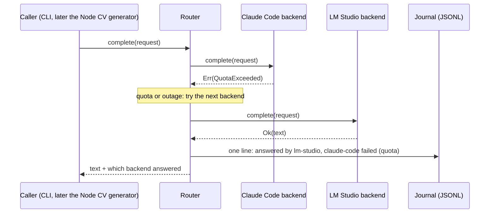

# Architecture

itsaresume takes a prompt and returns text from the first backend able to
answer it. It does nothing else — no document, no template, no CV logic.

Markers as in the roadmap: ✅ built and proved by a named test
([TESTING.md](TESTING.md)) · ⬜ designed, not built. A sentence in the present
tense without a marker describes something ✅.

## Request flow



## Error kinds, and why `Other` never falls back ✅

Every backend failure is exactly one of three kinds:

| Kind | Meaning | Router |
|---|---|---|
| `QuotaExceeded` | The backend refuses because a usage allowance is spent (Claude plan limit, HTTP 429) | tries the next backend |
| `Unreachable` | The backend could not be reached or did not answer in time: binary missing, connection refused, DNS, timeout, 502/503/504/529 | tries the next backend |
| `Other` | Anything else: the request was refused, the output was not understood, the backend is misconfigured, a billing tripwire fired | **stops**, returns the error |

`Other` stopping is deliberate. The two fallback kinds describe the
*backend's* state, which another backend does not share. Everything else is
either about the *request* (another backend would fail the same way, or worse,
answer a malformed request differently) or a condition a human has to fix
(not logged in, a changed CLI output format, API-key billing). Falling back on
those would turn a visible, fixable error into a silent, permanent
degradation: every request quietly answered by the second backend, and the
subscription never used, with nothing but a journal line to show for it. An
unknown error is classified `Other` for the same reason — the safe direction
for a misclassification is a loud stop, not a quiet reroute.

The cost is accepted: a `Claude` failure nobody anticipated stops the request
instead of being rescued by LM Studio. The fix is to add the case to the
classifier once it has been seen, with its fixture.

## Billing guards (3–5 ✅, 1–2 ⬜ until LM Studio and configuration land)

No backend is billed per token, and that is enforced in code, not only
promised (HANDOVER §1):

1. **The set of backend kinds is closed.** The configuration accepts
   `claude-code` and `lm-studio` and rejects any other kind.
2. **No backend has a credential field.** The LM Studio client never sends an
   `Authorization` header, so pointing its URL at a paid OpenAI-compatible
   service yields a 401 (`Other`, stop), not a bill.
3. **The Claude child process never sees metered credentials.** Claude Code
   prefers `ANTHROPIC_API_KEY` over the subscription when it is set (observed:
   `apiKeySource: "ANTHROPIC_API_KEY"`). The backend removes it, and the other
   variables that switch the CLI to a metered provider, from the child's
   environment.
4. **Tripwire on the CLI's own report.** The CLI's first message states its
   billing source (`apiKeySource`). Anything but `"none"` (subscription) is an
   `Other` error and the answer is discarded. The call may already have been
   billed; the tripwire makes sure it happens once and loudly, not for a month.
5. **`--bare` is never used**: it forces API-key authentication.

## Claude Code backend ✅

Runs `claude -p` with the prompt on **stdin** (no command-line length limit),
in a dedicated empty working directory (so no `CLAUDE.md` or project memory
is pulled into the prompt), with:

```
--output-format json --verbose --no-session-persistence
--tools "" --strict-mcp-config --disable-slash-commands
--system-prompt <request system prompt, or a neutral default>
[--model <configured alias>]
```

`--tools ""` matters beyond cost: CV prompts will contain job descriptions
copied from the web, and a prompt-injected instruction must have no tool to
call. The init message lists the tools; a non-empty list is refused
(tripwire, `Other`).

Output classification (observed shapes in
`crates/itsaresume-router/tests/fixtures/claude/`, HANDOVER §4):

| Condition | Kind |
|---|---|
| process could not start (binary not found) | `Unreachable` |
| no output within the timeout (process killed) | `Unreachable` |
| stdout is not the expected JSON | `Other` |
| `apiKeySource` ≠ `"none"`, or tools not empty | `Other` (tripwire) |
| `is_error: false` with a `result` string | success |
| `is_error: true`, `api_error_status` 429, or a known usage-limit message | `QuotaExceeded` |
| `is_error: true`, `api_error_status` 500–504 or 529 | `Unreachable` |
| any other `is_error: true` (e.g. "Not logged in") | `Other` |

`is_error` decides, never `subtype`: the not-logged-in case is observed with
`subtype: "success"`.

## LM Studio backend ⬜

`POST {base_url}/chat/completions` with `model`, `messages` (optional system,
then user) and `stream: false`; the answer is `choices[0].message.content`.

| Condition | Kind |
|---|---|
| connection refused, DNS failure, timeout | `Unreachable` |
| HTTP 502, 503, 504 | `Unreachable` |
| HTTP 429 | `QuotaExceeded` |
| any other non-2xx (400 context too long, 401, 404 model unknown, 500) | `Other` |
| 2xx without `choices[0].message.content` | `Other` |

## Journal ✅

One JSON object per line, appended to the configured file, one line per
request whatever its outcome:

```json
{"ts":"2026-09-23T19:04:05.123Z","outcome":"answered","backend":"lm-studio",
 "attempts":[{"backend":"claude-code","kind":"quota_exceeded","message":"…"}],
 "duration_ms":8123,"prompt_chars":1834,"answer_chars":2210}
```

`outcome` is `answered`, `stopped` (an `Other` error) or `exhausted` (every
backend failed with a fallback kind). **The prompt text and the answer text
are never written**, only their lengths: prompts will carry CV data. Error
messages are truncated to 200 characters. A journal that cannot be written
does not cost the caller the answer; the failure is reported alongside it.

## Configuration and CLI ⬜

`config.local.toml` (git-ignored; `config.example.toml` shows the shape).
`itsaresume complete` reads the prompt on stdin, prints the text on stdout and
the answering backend on stderr. Exit codes: 0 answered, 2 configuration or
usage error, 3 stopped (`Other`), 4 exhausted.

## HTTP endpoint ⬜

`itsaresume serve [--listen 127.0.0.1:8787]`:

| Request | Response |
|---|---|
| `POST /v1/complete` `{"prompt": "…", "system": "…"}` | 200 `{"backend", "text", "attempts"}` |
| same, a backend returned `Other` | 502 `{"error": {"kind": "stopped", "backend", "message"}}` |
| same, every backend failed with a fallback kind | 503 `{"error": {"kind": "exhausted", "attempts"}}` |
| malformed body | 400 |
| `GET /healthz` | 200 |

There is no authentication: whoever reaches the port spends Nicolas's plan.
It binds to `127.0.0.1` unless told otherwise, and the compose file publishes
it on the host's loopback only.

## Docker ⬜

One image: the router binary plus the `claude` CLI (pinned version) on a Node
runtime, running as a non-root user. The Claude backend authenticates with
`CLAUDE_CODE_OAUTH_TOKEN` — the long-lived **subscription** token printed by
`claude setup-token` — passed from a git-ignored `.env`. `ANTHROPIC_API_KEY`
is still removed from the child's environment, and the `apiKeySource`
tripwire still applies. LM Studio on the Docker host is reached as
`host.docker.internal:1234`; on another machine, through its Tailscale name.

## Code layout

```
crates/itsaresume-router/
  src/lib.rs            crate root
  src/backend.rs        Request, Completion, BackendError, trait Backend
  src/router.rs         Router: ordered fallback, Outcome, RouteError
  src/journal.rs        JSONL journal (lengths, never text)
  src/claude_code.rs    classify(), ClaudeCodeBackend, METERED_ENV
  src/bin/itsaresume-fake-claude.rs   test double of the claude CLI
  tests/fixtures/claude CLI outputs, observed and synthetic
scripts/
  sabotage.py           break a behaviour, see its tests go red, restore
  check-handover.py     keep the resume pointer honest
  merge-when-green.sh   merge only when every CI check passed
```
