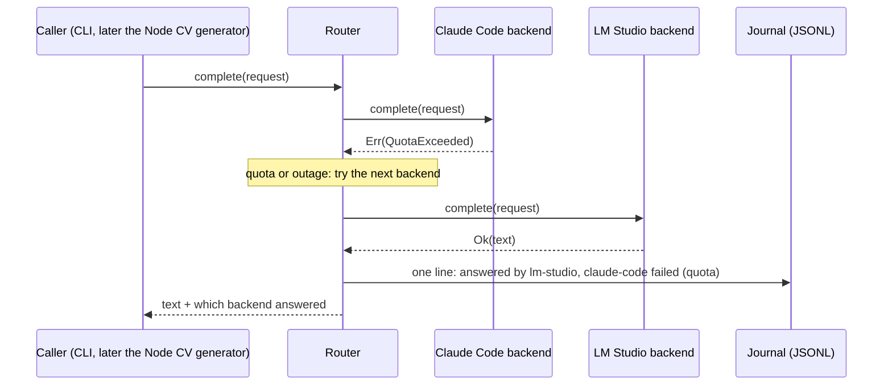

# Architecture

itsaresume takes a prompt and returns text from the first backend able to
answer it. It does nothing else — no document, no template, no CV logic.

Markers as in the roadmap: ✅ built and proved by a named test
([TESTING.md](TESTING.md)) · ⬜ designed, not built. A sentence in the present
tense without a marker describes something ✅.

## Request flow


```mermaid
sequenceDiagram
    participant C as Caller (CLI, later the Node CV generator)
    participant R as Router
    participant B1 as Claude Code backend
    participant B2 as LM Studio backend
    participant J as Journal (JSONL)
    C->>R: complete(request)
    R->>B1: complete(request)
    B1-->>R: Err(QuotaExceeded)
    Note over R: quota or outage: try the next backend
    R->>B2: complete(request)
    B2-->>R: Ok(text)
    R->>J: one line: answered by lm-studio, claude-code failed (quota)
    R-->>C: text + which backend answered
```

## Error kinds, and why `Other` never falls back ✅

Every backend failure is exactly one of three kinds:

| Kind | Meaning | Router |
|---|---|---|
| `QuotaExceeded` | The backend refuses because a usage allowance is spent (Claude plan limit, HTTP 429) | tries the next backend |
| `Unreachable` | The backend could not be reached or did not answer in time: binary missing, connection refused, DNS, timeout, 502/503/504/529 | tries the next backend |
| `Other` | Anything else: the request was refused, the output was not understood, the backend is misconfigured, a billing tripwire fired | **stops**, returns the error |

`Other` stopping is deliberate. The two fallback kinds describe the
*backend's* state, which another backend does not share. Everything else is
either about the *request* (another backend would fail the same way, or worse,
answer a malformed request differently) or a condition a human has to fix
(not logged in, a changed CLI output format, API-key billing). Falling back on
those would turn a visible, fixable error into a silent, permanent
degradation: every request quietly answered by the second backend, and the
subscription never used, with nothing but a journal line to show for it. An
unknown error is classified `Other` for the same reason — the safe direction
for a misclassification is a loud stop, not a quiet reroute.

The cost is accepted: a `Claude` failure nobody anticipated stops the request
instead of being rescued by LM Studio. The fix is to add the case to the
classifier once it has been seen, with its fixture.

## Billing guards ✅

No backend is billed per token, and that is enforced in code, not only
promised (HANDOVER §1):

1. **The set of backend kinds is closed.** The configuration accepts
   `claude-code` and `lm-studio` and rejects any other kind.
2. **No backend has a credential field.** The LM Studio client never sends an
   `Authorization` header, so pointing its URL at a paid OpenAI-compatible
   service yields a 401 (`Other`, stop), not a bill.
3. **The Claude child process never sees metered credentials.** Claude Code
   prefers `ANTHROPIC_API_KEY` over the subscription when it is set (observed:
   `apiKeySource: "ANTHROPIC_API_KEY"`). The backend removes it, and the other
   variables that switch the CLI to a metered provider or another
   configuration directory (`CLAUDE_CONFIG_DIR`), from the child's
   environment; and it passes `--setting-sources ""`, so no user or project
   settings file can set them back through an `env` block (observed on
   2.1.162: the empty list is accepted and OAuth still answers).
4. **Tripwire on the CLI's own report, latched.** The CLI's first message
   states its billing source (`apiKeySource`). Anything but `"none"`
   (subscription) is an `Other` error and the answer is discarded. The call
   may already have been billed: the tripwire then **latches**, in memory and
   in a marker file beside the journal (`<journal>.billing-tripped`), so no
   later request, nor a restarted server, starts claude again until the owner
   fixes the billing source and deletes the file. Scope: it sees API-key
   sources only; a paid gateway set through `ANTHROPIC_BASE_URL` or an auth
   token, or Bedrock/Vertex routing, is not reported there — guards 3 keep
   those variables and settings away instead.
5. **`--bare` is never used**: it forces API-key authentication.

## Claude Code backend ✅

Runs `claude -p` with the prompt on **stdin** (no command-line length limit),
in a dedicated empty working directory (so no `CLAUDE.md` or project memory
is pulled into the prompt), with:

```
--output-format json --verbose --no-session-persistence
--tools "" --strict-mcp-config --disable-slash-commands
--system-prompt-file <request system prompt, or a neutral default>
[--model <configured alias>]
```

The system prompt goes through a file, never the command line: argv is
length-limited (32 767 characters on Windows), cannot hold a NUL, and is
readable by every local process, while a system prompt may carry a whole
profile. The file is created new (`create_new`, 0600 on Unix) in the working
directory, one per request (process id and a counter), passed by absolute
path, and deleted when the call returns, answered or killed. A crash
mid-request leaves it behind in that directory.

`--tools ""` matters beyond cost: CV prompts will contain job descriptions
copied from the web, and a prompt-injected instruction must have no tool to
call. The init message lists the tools; a non-empty list is refused
(tripwire, `Other`).

**Structured output (8.24).** A request may carry a JSON Schema (`schema`
in `POST /v1/complete`). `lm-studio` sends it as a strict `json_schema`
`response_format` (Bionic honours it: the content is the document alone);
`claude-code` passes `--json-schema`, and then (observed on 2.1.162) the CLI
answers through a `StructuredOutput` tool: init lists it, `result` is empty,
the object is in `structured_output`. That one tool returns data and acts on
nothing, so the tool tripwire allows it **only** for a schema request and
**only alone**; any other tool, or `StructuredOutput` unasked, still stops
the request. Either way a schema answer that is not JSON is `Other`.

Output classification (observed shapes in
`crates/itsaresume-router/tests/fixtures/claude/`, HANDOVER §4):

| Condition | Kind |
|---|---|
| process could not start (binary not found) | `Unreachable` |
| no output within the timeout (process killed) | `Unreachable` |
| stdout is not the expected JSON | `Other` |
| `apiKeySource` ≠ `"none"`, or tools not empty | `Other` (tripwire) |
| `is_error: false` with a `result` string | success |
| `is_error: true`, `api_error_status` 429, or a known usage-limit message | `QuotaExceeded` |
| `is_error: true`, `api_error_status` 500–504 or 529 | `Unreachable` |
| any other `is_error: true` (e.g. "Not logged in") | `Other` |

`is_error` decides, never `subtype`: the not-logged-in case is observed with
`subtype: "success"`.

## LM Studio backend ✅

`POST {base_url}/chat/completions` with `model`, `messages` (optional system,
then user) and `stream: false`; the answer is `choices[0].message.content`.
Plain HTTP (`ureq` without TLS): Tailscale already encrypts the link between
machines. Observed on the XPS (fixtures in `tests/fixtures/lm-studio/`): the
server listens on `127.0.0.1:54321` there (the port is a setting, 1234 by
default); with a model loaded, an unknown `model` id is ignored and the
loaded model answers; a known but unloaded id is loaded on demand, which can
take over a minute — hence the generous default timeout.

| Condition | Kind |
|---|---|
| connection refused, DNS failure, timeout | `Unreachable` |
| HTTP 400 "No models loaded" (observed: server up, nothing loaded) | `Unreachable` |
| HTTP 502, 503, 504 | `Unreachable` |
| HTTP 429 | `QuotaExceeded` |
| any other non-2xx (other 400s, 401, 404, 500) | `Other` |
| 2xx without `choices[0].message.content` | `Other` |

## Journal ✅

One JSON object per line, appended to the configured file, one line per
request whatever its outcome:

```json
{"ts":"2026-09-23T19:04:05.123Z","outcome":"answered","backend":"lm-studio",
 "attempts":[{"backend":"claude-code","kind":"quota_exceeded","message":"…"}],
 "duration_ms":8123,"prompt_chars":1834,"answer_chars":2210}
```

`outcome` is `answered`, `stopped` (an `Other` error) or `exhausted` (every
backend failed with a fallback kind). **The prompt text and the answer text
are never written**, only their lengths: prompts will carry CV data. Error
messages are truncated to 200 characters, and a body, a stdout or a result
message the router does not understand is given as a length, never quoted
(8.41): it can hold model text. The one excerpt left is `claude`'s stderr
when it printed nothing on stdout (the CLI's own diagnostics). A journal that cannot be written
does not cost the caller the answer; the failure is reported alongside it.

An answer also carries, when its backend reports them, `rate_limit` (Claude's
`rate_limit_event`, 8.32) and `usage` (8.38): the tokens it took,
`{"input":3,"output":179,"cache_read":6914,"cache_creation":7109}`. Claude's
come from the result message's `usage` (`input_tokens`, `output_tokens`,
`cache_read_input_tokens`, `cache_creation_input_tokens`); the local
model's from the OpenAI-compatible `usage` (`prompt_tokens`,
`completion_tokens`; no cache, 0). Observed: a real Claude call reads almost
all its input from the prompt cache, hence the counts kept apart.
`itsaresume stats` sums them per backend, so Claude and the local model are
read apart.

## Configuration and CLI ✅

`config.local.toml` (git-ignored; `config.example.toml` shows the shape).
`itsaresume complete` reads the prompt on stdin, prints the text on stdout and
the answering backend on stderr. Exit codes: 0 answered, 2 configuration or
usage error, 3 stopped (`Other`), 4 exhausted.

## HTTP endpoint ✅

`itsaresume serve [--listen 127.0.0.1:8787]`:

| Request | Response |
|---|---|
| `POST /v1/complete` `{"prompt": "…", "system": "…"}` | 200 `{"backend", "text", "attempts"}`, and `"usage"` when the backend reported tokens (8.39) |
| same, a backend returned `Other` | 502 `{"error": {"kind": "stopped", "backend", "message"}}` |
| same, every backend failed with a fallback kind | 503 `{"error": {"kind": "exhausted", "attempts"}}` |
| malformed body | 400 |
| `GET /healthz` | 200 `{"status": "ok"}` |

Every answer, refusals and `/healthz` included, also carries
`"contract": "1.0"` (next section).

There is no authentication: whoever reaches the port spends Nicolas's plan.
It binds to `127.0.0.1` unless told otherwise, and the compose file publishes
it on the host's loopback only.

## Contract with the generator ✅

Frozen at **1.0** (8.37, 2026-10-05), **1.1** since `GET /status` (8.43);
`server::CONTRACT` holds the version.
These fields, and only these, make the contract:

| Where | Field | Type | Meaning |
|---|---|---|---|
| request | `prompt` | string, not blank | the user turn (required) |
| request | `system` | string | the system prompt |
| request | `backend` | string | try this configured backend alone (8.22) |
| request | `schema` | JSON Schema object | ask for structured output (8.24) |
| request | `kind` | `"generate"` (default) or `"classify"` | which backends may take it (8.34) |
| every answer | `contract` | `"MAJOR.MINOR"` | the contract the router speaks |
| 200 | `text` | string | the answer |
| 200 | `backend` | string | the backend that answered |
| 200 | `attempts` | array of `{backend, kind, message}` | the backends that failed first |
| 200 | `usage` | `{input, output, cache_read, cache_creation}`, optional | tokens, when the backend reported them (8.39) |
| refusal | `error.kind` | string | `stopped`, `exhausted`, `unserved`, `bad_request`, `too_large`, `busy`, … |
| refusal | `error.message` | string | why, for a human |
| refusal | `error.backend` | string, `stopped` only | the backend that stopped it |
| refusal | `error.attempts` | array, `stopped`/`exhausted`/`unserved` | as on 200 |
| any | `journal_error` | string, optional | the answer stands, its journal line was not written |
| `GET /status` (1.1) | `backends` | array of `{name, kind, state, reason?, loaded?, since?}` | each backend in the router's order, nothing spent (8.43): `state` is `up`, `down`, `limited` (a quota), `stopped` (another error) or `unknown`; from the backend's probe (LM Studio: `/v1/models` and `/api/v0/models`, 3 s) when it has one, else from its last answer, `since` in Unix seconds; `loaded` says whether the local model is in memory (false: it loads at the first request) |

A new optional field bumps the minor; removing, renaming or changing the
meaning of a field bumps the major. `tests/server.rs` holds the answer to
exactly this key set; `cv/test/client.test.js` holds the client to the
major.

**ADR — an answer without `contract`** (2026-10-05). *Context.* The
generator on the VM and the router on the laptop are deployed apart, so a
1.x client can meet a router built before the field. *Decision.* The client
(`cv/src/llm.js`, `CONTRACT_MAJOR`) reads an answer without `contract` as
contract 1.0, refuses any other major or a malformed version before reading
the answer (the error names both), and accepts any 1.x minor.
*Consequences.* A router older than the field keeps working: its answers
are 1.0 by construction (this freeze wrote down the fields it already sent).
A future major is never misread, because every router that has the field
sends it. The cost: a server that is not itsaresume at all and omits the
field is read as 1.0; it is caught by the existing checks (no `text` →
error).

## Docker ✅

One image: the router binary plus the `claude` CLI (pinned version) on a Node
runtime, running as a non-root user. The Claude backend authenticates with
`CLAUDE_CODE_OAUTH_TOKEN` — the long-lived **subscription** token printed by
`claude setup-token` — passed from a git-ignored `.env`. `ANTHROPIC_API_KEY`
is still removed from the child's environment, and the `apiKeySource`
tripwire still applies. LM Studio on the Docker host is reached as
`host.docker.internal:1234`; on another machine, through its Tailscale name.
Observed on the XPS: Docker Desktop reaches LM Studio bound to `127.0.0.1`
through `host.docker.internal` (answer in 2.0 s). `scripts/docker-smoke.sh`
runs the image with the real `claude` CLI inside (TESTING.md).

## Code layout

```
crates/itsaresume-router/
  src/lib.rs            crate root
  src/backend.rs        Request, Completion, BackendError, trait Backend
  src/router.rs         Router: ordered fallback, Outcome, RouteError
  src/journal.rs        JSONL journal (lengths, never text)
  src/claude_code.rs    classify(), ClaudeCodeBackend, METERED_ENV
  src/bin/itsaresume-fake-claude.rs   test double of the claude CLI
  src/lm_studio.rs      LmStudioBackend (HTTP, no credential field)
  src/config.rs         TOML configuration, closed kinds, no credentials
  src/server.rs         HTTP endpoint (tiny_http, thread per request)
  src/main.rs           the itsaresume binary: complete, serve
  tests/fixtures/claude CLI outputs, observed and synthetic
scripts/
  sabotage.py           break a behaviour, see its tests go red, restore
  check-handover.py     keep the resume pointer honest
  merge-when-green.sh   merge only when every CI check passed
```
