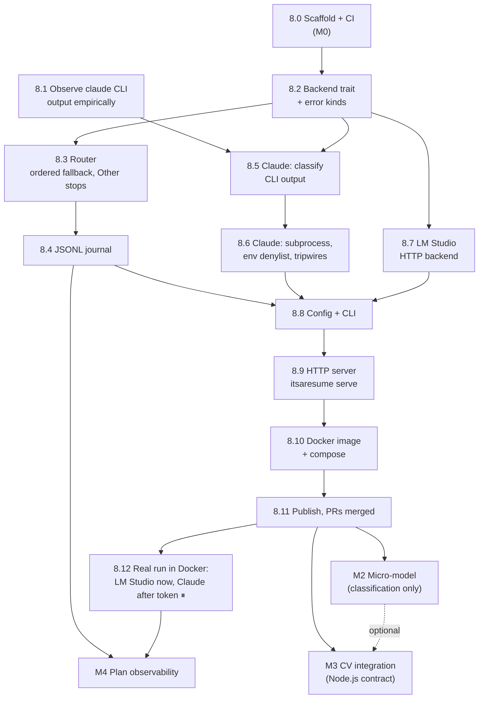

# Roadmap

What is done and what is not, kept true in the same commit as the code. The
detailed, tickable steps for the current milestone are in
[HANDOVER.md §8](HANDOVER.md#8-ordered-steps-to-the-mvp); this page is the
overview.

Markers: ✅ done and proved by a named test · 🟨 in progress · ⬜ not started ·
⏸ waiting on Nicolas.

## Milestone board

| | Milestone | Goal | Exit criterion | Status |
|---|---|---|---|---|
| **M0** | Scaffold | Workspace, docs, CI and guard scripts exist before any feature | CI green on the scaffold PR; `check-handover.py` passes | 🟨 |
| **M1** | MVP router in Docker | A prompt sent over HTTP to a container goes to Claude Code (subscription), falls back to LM Studio on quota or outage, and every request leaves one journal line | Every M1 step of HANDOVER §8 ticked, merged, CI green (image build included); all fallback/error tests sabotage-verified in CI; one real answer from LM Studio through the container | ⬜ |
| **M2** | Micro-model | A small model on the Pi or the Freebox VM takes **classification** requests only | The router refuses to send a generation request to it, proved by a sabotage-verified test | ⬜ |
| **M3** | CV integration | The Node.js CV generator calls the M1 HTTP endpoint; the contract is versioned and frozen | The Node project runs one end-to-end CV through it on Nicolas's machines | ⬜ |
| **M4** | Plan observability | Nicolas can see whether his Pro/Max plan carries the load | A report answers "what share of today's requests did Claude answer, and when did it run out" from the journal alone | ⬜ |

### M1 — what it contains

- `Backend` trait with three error kinds; `Router` with ordered fallback where
  only `QuotaExceeded` and `Unreachable` fall back and `Other` stops.
- A JSONL journal: one line per request, never the prompt text.
- `ClaudeCodeBackend`: the `claude` CLI as a subprocess, tools disabled,
  metered-billing environment variables removed, and a tripwire refusing any
  answer the CLI reports as API-key billed.
- `LmStudioBackend`: OpenAI-compatible HTTP, with no credential field at all.
- A TOML configuration whose backend kinds are a closed list, and a CLI.
- `itsaresume serve`: a small HTTP endpoint (`POST /v1/complete`), bound to
  localhost by default.
- A Docker image (router + `claude` CLI) and a compose file; the Claude
  backend authenticates in the container with a subscription OAuth token
  (`claude setup-token`), never an API key.

### M2 — what it will need (not designed in detail yet)

- A request *kind* (`generate` / `classify`) and backends declaring which kinds
  they serve; the router skipping a backend that does not serve the kind.
- A choice of runtime on the Pi 4B (4 GB) / Freebox VM (aarch64): llama.cpp
  server or Ollama, and a model small enough to answer in seconds. Open: §9.

### M3 — what it will need

- The Node.js project calling `POST /v1/complete` (built in M1), and the
  contract frozen with a version and contract tests.
- The CV generator itself stays in its own repository; itsaresume never builds
  a document.

### M4 — what it will need

- The Claude CLI reports `usage`, `modelUsage` and `total_cost_usd` (notional
  on a subscription) per call. Journal them, then summarise per day: share per
  backend, quota hits and when they happened.

## Dependencies between steps

Step numbers are those of [HANDOVER.md §8](HANDOVER.md#8-ordered-steps-to-the-mvp).

