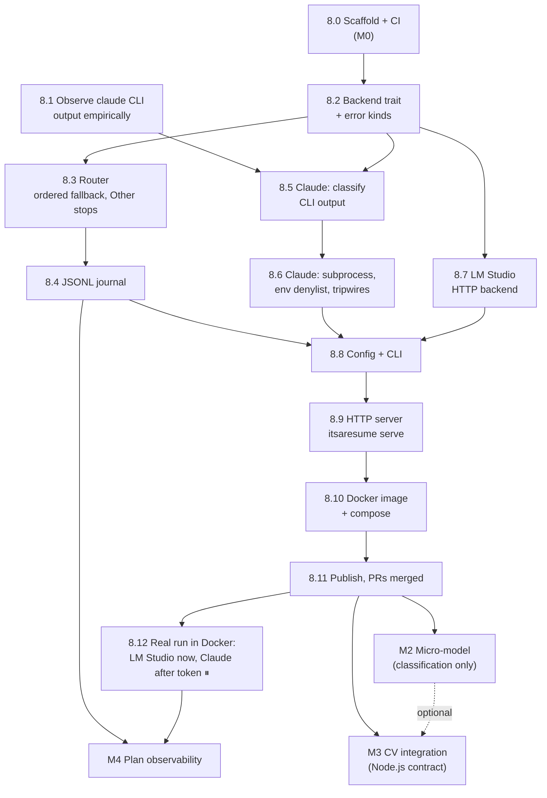

# Roadmap

What is done and what is not, kept true in the same commit as the code. The
detailed, tickable steps for the current milestone are in
[HANDOVER.md §8](HANDOVER.md#8-ordered-steps-to-the-mvp); this page is the
overview.

Markers: ✅ done and proved by a named test · 🟨 in progress · ⬜ not started ·
⏸ waiting on Nicolas.

## Milestone board

| | Milestone | Goal | Exit criterion | Status |
|---|---|---|---|---|
| **M0** | Scaffold | Workspace, docs, CI and guard scripts exist before any feature | CI green on the scaffold PR; `check-handover.py` passes | ✅ merged (PR #1) |
| **M1** | MVP router in Docker | A prompt sent over HTTP to a container goes to Claude Code (subscription), falls back to LM Studio on quota or outage, and every request leaves one journal line | Every M1 step of HANDOVER §8 ticked, merged, CI green (image build included); all fallback/error tests sabotage-verified in CI; one real answer from LM Studio through the container | ✅ merged (PR #1, #2); hardened through 8.30 (2026-09-30): one completion at a time per local backend, no userinfo in a `base_url`, a private Claude working directory, an overage tripwire; 91 defences verified on Linux (CI and WSL). Only 8.12's Claude half waits (⏸ the owner's `claude setup-token`) |
| **M2** | Micro-model | A small model on the Pi or the Freebox VM takes **classification** requests only | The router refuses to send a generation request to it, proved by a sabotage-verified test | 🟨 the criterion is proved in the router (8.34: request `kind`, backend `serves`, sabotage-verified); the generator sends `kind` (8.36) but marks no call yet: measured, the local model already loses on the split (7/14 against 14/14) and the listing (69/75 against 75/75); the runtime and model on the Pi or VM are not chosen yet |
| **M3** | CV integration | The Node.js CV generator calls the M1 HTTP endpoint; the contract is versioned and frozen | The Node project runs one end-to-end CV through it on Nicolas's machines | 🟨 end-to-end CVs run through it (Claude, and the local model alone: 239 s); a request may name its backend (8.22) and carry a JSON schema (8.24); the contract is frozen at 1.0 with tests on both sides (8.37) |
| **M4** | Plan observability | Nicolas can see whether his Pro/Max plan carries the load | A report answers "what share of today's requests did Claude answer, and when did it run out" from the journal alone | ✅ `itsaresume stats` (8.30) and `stats --by-day` (8.33): per day, who answered and the time of the first quota hit, from the journal alone (the `rate_limit` Claude reports rides in it since 8.32) |

### M1 — what it contains

- `Backend` trait with three error kinds; `Router` with ordered fallback where
  only `QuotaExceeded` and `Unreachable` fall back and `Other` stops.
- A JSONL journal: one line per request, never the prompt text.
- `ClaudeCodeBackend`: the `claude` CLI as a subprocess, tools disabled,
  metered-billing environment variables removed, and a tripwire refusing any
  answer the CLI reports as API-key billed.
- `LmStudioBackend`: OpenAI-compatible HTTP, with no credential field at all.
- A TOML configuration whose backend kinds are a closed list, and a CLI.
- `itsaresume serve`: a small HTTP endpoint (`POST /v1/complete`), bound to
  localhost by default.
- A Docker image (router + `claude` CLI) and a compose file; the Claude
  backend authenticates in the container with a subscription OAuth token
  (`claude setup-token`), never an API key.
- Since 2026-09-30 (8.17-8.30): `max_concurrent` per local backend (one
  slot by default: the wait counts against the timeout, then falls back);
  config `name`s and a request naming one backend (no fallback); a JSON
  schema per request (`response_format` to LM Studio, `--json-schema` to
  Claude, which answers through its `StructuredOutput` tool, allowed only
  then); the tripwires extended to extra usage (`isUsingOverage`); the
  journal says how a request was asked; `itsaresume stats`.

### M2 — what it will need (not designed in detail yet)

- A request *kind* (`generate` / `classify`) and backends declaring which kinds
  they serve; the router skipping a backend that does not serve the kind.
- A choice of runtime on the Pi 4B (4 GB) / Freebox VM (aarch64): llama.cpp
  server or Ollama, and a model small enough to answer in seconds. Open: §9.

### M3 — what it will need

- The Node.js generator, in `cv/` of this repository since 2026-09-30
  (the router never builds a document), already calls `POST /v1/complete`.
- Next: the analysis call's schema (a closed list of skill ids), sent only
  if measured not to cost recall or verdicts (the listing's schema cost the
  local model recall: 61-66/75 against 68-70/75, so it stays opt-in). It
  needs no new field: the contract, frozen at 1.0 (8.37), already carries
  `schema`.

### M4 — what it will need

- The Claude CLI reports `usage`, `modelUsage` and `total_cost_usd` (notional
  on a subscription) per call, and a `rate_limit_event` (`status`,
  `rateLimitType`, `isUsingOverage`). Journal them, then summarise per day:
  share per backend, quota hits and when they happened. `itsaresume stats`
  (8.30) is the first half, over the whole journal. Done: `rate_limit`
  (8.32), `--by-day` (8.33), tokens per backend (`usage`, 8.38).
  `total_cost_usd` is not journaled: on a plan it is notional, and a dollar
  figure in the journal would read as a bill.

## Dependencies between steps

Step numbers are those of [HANDOVER.md §8](HANDOVER.md#8-ordered-steps-to-the-mvp).

```mermaid
flowchart TD
    M0["8.0 Scaffold + CI<br/>(M0)"] --> T["8.2 Backend trait<br/>+ error kinds"]
    OBS["8.1 Observe claude CLI<br/>output empirically"] --> CL1
    T --> R["8.3 Router<br/>ordered fallback, Other stops"]
    R --> J["8.4 JSONL journal"]
    T --> CL1["8.5 Claude: classify<br/>CLI output"]
    CL1 --> CL2["8.6 Claude: subprocess,<br/>env denylist, tripwires"]
    T --> LM["8.7 LM Studio<br/>HTTP backend"]
    J --> CFG["8.8 Config + CLI"]
    CL2 --> CFG
    LM --> CFG
    CFG --> SRV["8.9 HTTP server<br/>itsaresume serve"]
    SRV --> DOCK["8.10 Docker image<br/>+ compose"]
    DOCK --> PUB["8.11 Publish, PRs merged"]
    PUB --> REAL["8.12 Real run in Docker:<br/>LM Studio now, Claude after token ⏸"]
    PUB --> M2["M2 Micro-model<br/>(classification only)"]
    PUB --> M3["M3 CV integration<br/>(Node.js contract)"]
    J --> M4["M4 Plan observability"]
    REAL --> M4
    M2 -.optional.-> M3
```
